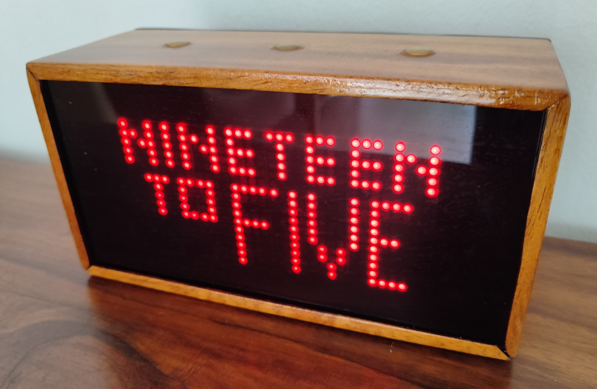
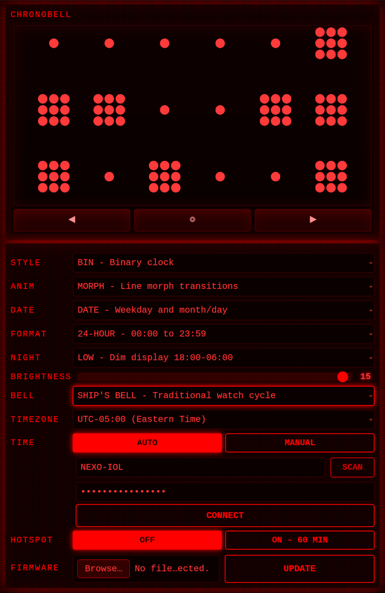

# ChronoBell

ChronoBell is a compact LED clock with a bright, easy-to-read display, simple touch controls, a classic bell sound, and a handful of thoughtful extras that give it a distinctive character. It can show short local messages and guest WiFi details, and it includes several display styles and date views.

 

## What makes it different

**A bell that rings like a ship's clock** - Traditional 1-8 strike pattern from nautical tradition, plus six other modes: off, single ding, hour count, half-hour, pair, and triple. You can hear each one in the menu before you choose it.

**9 display styles + 5 date views** - Big digits, a configurable INFO overlay, word clock, roman numerals, binary, bar graphs, drift, pong, or a configurable random view. INFO can show seconds, deciseconds, date, WDAY, or alternate between date and WDAY every N seconds after entering ALT. Drift uses the big digital layout, but lets displayed time slowly move away from real time and return. BAR turns hours, minutes, and optional seconds into stacked progress bars. Pong plays a live rally that scores the current time. Date views include day and month, year, moon phase, Western zodiac, and Chinese zodiac. Tap to peek at any view.

**Local messages** - Pulls short notices from your router and shows them as brief previews, with a small unread indicator when something is waiting.

**Guest WiFi on screen** - Shows the guest network name and password right on the clock. No phone needed. Good for lobbies, cafes, offices.

**Set time manually or let it self-correct** - It can set itself from WiFi and keep time on a battery-backed clock chip when offline. Or switch to manual mode and step through hour, minute, second, month, day, and year from the menu.

**Two ways to configure** - Tap the menu to change any setting on the device. Or press the BOOT button or flip HOTSPOT to ON in the menu to open the setup portal in your browser for WiFi, timezone, brightness - even firmware updates.

**Three touch pads, no moving parts** - Left, center, right. Tap to navigate, hold for the menu, hold longer for auto-repeat.

---

## What you can do with it

- **Bell** - Off, single ding, hour count, half-hour, pair, triple, or ship's bell. Hear a preview as you scroll.
- **Timer** - Use it as a stopwatch or a countdown timer. Countdown presets range from 1 to 90 minutes, and when time runs out the clock flashes `00:00`, rings a 3-2-1 alert, and clears itself after 15 minutes.
- **Night mode** - Dim the display, turn it off, mute the bell, or any combo - all on a schedule. Touch the clock to wake it for a minute.
- **Manual time** - Switch from atomic (NTP + RTC) to manual and step through HH→MM→SS→Month→Day→Year. Persists across reboots.
- **Config portal** - Scan WiFi networks, pick a timezone, tune display and bell settings, upload firmware - all from a browser.
- **New Year's Eve feature** - On Dec 31 from 9 PM, tiny sparkles appear and grow more frequent. At 23:50 the countdown begins, at midnight the display cycles through "HAPPY NEW YEAR" with 12 bell strikes.
- **Local messages** - Router-side scripts can send short notices like `BACKUP DONE`, `SERVER DOWN`, or `DOMAIN / AVAILABLE`.
- **Timekeeping** - NTP syncs every 60 minutes when WiFi is available. The RTC keeps time when it's not. Manual mode bypasses both.
- **OTA updates** - Push firmware over the air at `chronobell.local`.

---

## Clock Styles

ChronoBell has nine clock display modes. The menu label is short because the screen is only 32x16 pixels:

| Style | Menu | What it shows |
|-------|------|---------------|
| Random | RND | Changes at the configured hour interval using BIG, INFO, WORD, ROMA, or BIN |
| Big | BIG | Large HH:MM digits, optimized for readability |
| Info | INFO | Time on top with a selectable second line |
| Word clock | WORD | A compact phrase-style clock such as "TWENTY TO THREE" |
| Roman | ROMA | Roman-numeral-style hours and minutes |
| Dial | DIAL | Minimal analog dial with optional cardinal marks and ellipse-scaled hands |
| Binary | BIN | Binary hour, minute, and second rows |
| Bar | BAR | Hour, minute, and optional second progress bars |
| Pong | PONG | A live rally where each player's score is the current time; miss sequence on every minute/hour change |
| Drift | DRIFT | BIG-style digits where displayed time slowly drifts and returns |

### Date Views

The DATE clock style and the standalone date screen use the same five date views:

| Style | Menu | What it shows |
|-------|------|---------------|
| Date | DATE | Weekday and month/day |
| Year | YEAR | Calendar year and day of year |
| Moon | MOON | Lunar phase state plus the next full/new moon countdown |
| Western zodiac | ZOD | Western zodiac sign plus element |
| Chinese zodiac | CZOD | Chinese zodiac animal plus element |

## Timer

The timer screen has two jobs:

| Mode | What it does |
|------|--------------|
| Stopwatch | Counts up from zero until you stop it |
| Countdown | Counts down from a chosen preset, then alerts you when it reaches zero |

Stopwatch and countdown both keep their state across reboots. The center button moves between the clock, date, guest WiFi, stopwatch, and countdown screens. On the countdown screen, the right button changes the preset and the left button starts or pauses the timer.

When a countdown finishes, ChronoBell shows a blinking `00:00`, plays a short alert pattern, and stays on the countdown screen until you acknowledge it.

---

## Local JSON Messages

ChronoBell can poll a LAN HTTP endpoint for generic active messages. This is intentionally not domain-specific: any router script can produce messages, and the clock only consumes display-ready title/body text plus priority and scheduling fields.

Default firmware config in `Config.h`:

```cpp
#define CHRONOMSG_ENABLED 1
#define CHRONOMSG_URL "http://192.168.8.1/cgi-bin/chronomsg"
#define CHRONOMSG_POLL_INTERVAL_SEC 60
#define CHRONOMSG_MAX_MESSAGES 5
```

The display stays in the current clock mode. If an unread active message exists, the bottom-left pixel blinks in bursts. A short press on center shows the selected unread message immediately; a long-press on center dismisses it and advances to the next unread message if one exists. Dismissed IDs are sent to the router message endpoint (`?msg&dismiss=<id>`) and kept in RAM to filter re-display until the next poll.

Message text is normalized before display: whitespace is trimmed/collapsed, letters are uppercased, common accents are folded to ASCII, unsupported characters become spaces, and only the existing small proportional font is used. Each line renders independently — if it fits, it's centered; if it overflows, it scrolls seamlessly with a 4-pixel gap between repeats (3 overlapping copies, no blank frames). There is no `mode` field; the firmware decides per line.

Expected `?msg` response:

```json
{
  "device": "chronobell",
  "now": 1782580100,
  "messages": [
    {
      "id": "domain-drop-comonoclaroquesi",
      "source": "domain-watch",
      "type": "alert",
      "priority": 9,
      "title": "DOMAIN",
      "body": "AVAILABLE",
      "created": 1782580000,
      "expires": 1782666400,
      "display": {
        "repeat": true,
        "duration": 8,
        "interval": 60,
        "indicator": true,
        "dismissible": true
      }
    }
  ]
}
```

Expected `?wifi` response:

```json
{
  "device": "chronobell",
  "now": 1782580100,
  "guestwifi": {
    "ssid": "NEXO-GUEST",
    "password": "XKQPVJTHZNLD"
  }
}
```

Priority behavior:

| Priority | Indicator burst speed | Automatic preview |
|----------|-----------------------|-------------------|
| 0-4 | 2400ms period, count × blink, 1500ms pause | None unless center is tapped |
| 5-6 | 2400ms period, count × blink, 1500ms pause | First calm preview, repeat every 10 minutes if `repeat` |
| 7-8 | 1200ms period, count × blink, 1500ms pause | Preview soon, repeat every 3 minutes if `repeat` |
| 9 | 200ms period, count × blink, 1500ms pause | Preview as soon as practical, repeat every 60 seconds if `repeat` |

The indicator blinks `count` times at the priority period, then pauses 1.5s before repeating. If `display.interval` is present, it overrides the priority repeat interval. Preview duration defaults to 6 seconds and is clamped to 3-15 seconds.

### Router Message Endpoint

The `router/chronomsg` script is a self-contained POSIX shell tool for GL.iNet/OpenWrt routers. Install it as `/usr/bin/chronomsg` and expose it as a CGI wrapper:

```sh
scp router/chronomsg root@192.168.8.1:/usr/bin/chronomsg
ssh root@192.168.8.1
chmod +x /usr/bin/chronomsg
mkdir -p /www/cgi-bin
cat > /www/cgi-bin/chronomsg <<'EOF'
#!/bin/sh
exec /usr/bin/chronomsg serve --cgi
EOF
chmod +x /www/cgi-bin/chronomsg
```

Test the endpoint:

```sh
/usr/bin/chronomsg add DOMAIN "AVAILABLE"
wget -qO- "http://192.168.8.1/cgi-bin/chronomsg?msg"
wget -qO- "http://192.168.8.1/cgi-bin/chronomsg?wifi"
```

`chronomsg` stores state under `$BASE` (default `/etc/chronomsg/`), including message files, the cached message payload, domain-check state, guest QR seed/config state, a cron lock, and dismissed IDs. State persists across reboots; the tool recreates missing directories on use.

Useful commands:

```sh
/usr/bin/chronomsg serve
/usr/bin/chronomsg serve --cgi
/usr/bin/chronomsg add DOMAIN "AVAILABLE"

/usr/bin/chronomsg add \
  --id domain-drop-comonoclaroquesi \
  --source domain-watch \
  --type alert \
  --priority 9 \
  --title DOMAIN \
  --body "AVAILABLE" \
  --ttl 86400 \
  --repeat true \
  --duration 8 \
  --interval 60

/usr/bin/chronomsg clear domain-drop-comonoclaroquesi
/usr/bin/chronomsg list
/usr/bin/chronomsg rebuild
/usr/bin/chronomsg check-domain comonoclaroquesi.com
/usr/bin/chronomsg cron add check-domain comonoclaroquesi.com
/usr/bin/chronomsg cron remove check-domain
```

The CGI endpoint is query-driven:

- `?msg` serves the cached message JSON and accepts `dismiss=<id>`
- `?wifi` serves the guest WiFi JSON
- `?add` creates a message using the same fields as `chronomsg add`
- `?clear&id=<id>` clears a message, and `?clear&all=true` clears all messages
- `?dismiss&id=<id>` dismisses a message, and `?undismiss&id=<id>` makes it visible again
- `?dismissed` lists dismissed message IDs
- `?guestqr` updates guest QR settings and optionally applies a new guest WiFi password
- `?check-domain&domain=<domain>` runs the domain checker and publishes any resulting message

The write/control API accepts both query strings and `application/x-www-form-urlencoded` POST bodies. It is intended for trusted LAN scripts and is not authenticated, so do not expose the CGI endpoint to the public internet.

Examples:

```sh
curl -G "http://192.168.8.1/cgi-bin/chronomsg?add" \
  --data-urlencode title="BACKUP" \
  --data-urlencode body="DONE" \
  --data-urlencode priority=7 \
  --data-urlencode ttl=3600

curl -G "http://192.168.8.1/cgi-bin/chronomsg?clear" \
  --data-urlencode id="backup-1782580100"

curl -G "http://192.168.8.1/cgi-bin/chronomsg?guestqr" \
  --data-urlencode rotate=weekly \
  --data-urlencode ssid="NEXO-GUEST" \
  --data-urlencode length=12

curl -G "http://192.168.8.1/cgi-bin/chronomsg?check-domain" \
  --data-urlencode domain="comonoclaroquesi.com" \
  --data-urlencode force=true
```

`?guestqr` supports `rotate`, `seed`, `ssid`, `section`, `length`, `alphabet`, `outdir`, `no-apply=true`, and `no-html=true`. Without `no-apply=true`, it may update the router's live guest WiFi password.

`?check-domain` supports `domain`, optional `id`, and `force=true`. It runs WHOIS/RDAP synchronously and can block while the registrar lookup completes. ChronoBell polling with `?msg` and `?wifi` never runs RDAP, WHOIS, `curl`, or `wget`, so a slow registrar or network error cannot block the display.

Domain checks run from cron or manually:

```sh
/usr/bin/chronomsg cron add check-domain comonoclaroquesi.com
/usr/bin/chronomsg check-domain comonoclaroquesi.com
```

The domain checker is conservative. It tries WHOIS first, then falls back to RDAP if WHOIS fails or returns ambiguous results. WHOIS `redemptionPeriod` or `pendingDelete` creates a priority 7 `DOMAIN / REDEMPTION` alert, using the same repeat timing as the other priority 7 domain message. WHOIS or RDAP no-match creates a priority 9 `DOMAIN / AVAILABLE` alert. Registered domains with name servers or registrar fields create no alert. Ambiguous status creates a lower-priority `DOMAIN / CHECK` alert. Network errors update state to `ERROR`.

Manual tests:

```sh
rm -rf /etc/chronomsg
/usr/bin/chronomsg serve
/usr/bin/chronomsg add DOMAIN "AVAILABLE"
/usr/bin/chronomsg serve
/usr/bin/chronomsg clear <id>
/usr/bin/chronomsg add --ttl 1 TEST EXPIRE
sleep 2
/usr/bin/chronomsg rebuild
/usr/bin/chronomsg cron add check-domain comonoclaroquesi.com
grep chronomsg /etc/crontabs/root
/usr/bin/chronomsg cron remove check-domain
```

Troubleshooting starts with `$BASE/chronomsg.log` and `$BASE/domain-state`. Set `CHRONOMSG_BASE` to change the state directory. If neither `whois` nor `curl`/`wget` exists on the router, `check-domain` enters the safe `ERROR` state and does not create alerts.

---

## Bell Modes

The bell can be off, simple, clock-like, or nautical. Scroll through BELL in the menu to hear a live preview before saving.

| Mode | Menu | What it does |
|------|------|--------------|
| Off | OFF | No scheduled bell |
| Single ding | DING | One strike on the hour only |
| Hour count | HOUR | Rings the 12-hour count on the hour, from 1 to 12 strikes |
| Half-hour | HALF | Rings the hour count on the hour, plus one strike at :30 |
| Pair | PAIR | Rings the hour count in groups of two with a short pause between pairs |
| Triple | TRIP | Rings the hour count in groups of three with a short pause between groups |
| Ship's bell | SHIP | Traditional ship's clock pattern: 1 to 8 strikes across the four-hour watches, with the half-hour counted in the sequence |

Timer alerts are separate from scheduled bell modes: when a countdown expires, ChronoBell plays its alert pattern even if the display is not in a clock style.

---

## Getting Started

### Build and upload

```bash
# PlatformIO
pio run --target upload

# Arduino CLI
arduino-cli compile --fqbn esp32:esp32:esp32
arduino-cli upload --fqbn esp32:esp32:esp32
```

### First boot

1. Upload the firmware to your ESP32.
2. Connect to the **ChronoBell** WiFi access point and open `http://192.168.4.1`.
3. Scan for your network, enter the password, pick your timezone, and save.

The clock reboots, connects to WiFi, syncs time, and starts running.

### Reopen the config portal

Press the **BOOT** button or toggle **HOTSPOT** to ON in the menu.

---

## Touch Controls

| Gesture | Pad | What it does |
|---------|-----|-------------|
| Tap | Left | Previous menu item / previous display style / stopwatch start-stop / acknowledge expired countdown and stay on Countdown |
| Tap | Center | Confirm a menu choice / cycle views (Clock → Date → Guest WiFi → Stopwatch → Countdown) / acknowledge timer alert (returns to Clock only if the alert came from Clock) |
| Tap | Right | Next menu item / next display style / cycle countdown preset |
| Hold 1.5s | Center | Enter the menu |
| Hold (auto-repeat) | Left or Right | Scroll fast through menu items or countdown presets |

When night mode turns the display off, any touch wakes it for a minute.

---

## Menu

| Item | Choices | What it sets |
|------|---------|-------------|
| STYLE | RND / BIG / INFO / WORD / ROMA / DIAL / BAR / BIN / PONG / DRIFT | Clock style; drift is the mode that makes now feel less fixed |
| ANIM | OFF / ON | Enable or disable clock transitions |
| INFO | SEC / DECI / DATE / WDAY / ALT | Second-line choice for the INFO style |
| DATE | DATE / YEAR / MOON / ZOD / CZOD | Extra info shown in the date view |
| FORMAT | 24H / 12H | 24-hour or AM/PM |
| NIGHT | OFF / LOW / LOWM / DARK / DRKM / MUTE | Dim, mute, or turn off the display and bell on a schedule |
| BRIGHT | 0-15 | How bright the LEDs shine |
| BELL | OFF / DING / HOUR / HALF / PAIR / TRIP / SHIP | Scheduled bell/chime mode (scroll to hear a preview) |
| SECOND | OFF / ON | Show the seconds bars in BAR mode |
| SETTIME | AUTO / MANUAL | Time source - automatic (NTP + RTC) or manual entry |
| HOTSPOT | OFF / ON | Turn the web config portal on or off |

Hold center to enter the menu, left/right to browse, and tap center to edit. Each confirm saves the current step immediately. STYLE has a second step for clocks with configurable details: BIG, INFO, and DRIFT offer separator choices, DIAL offers MARKS OFF or ON, BAR offers the SECOND toggle for optional seconds bars, and BIN offers a SECOND toggle for binary seconds. INFO first opens a second-line chooser labeled INFO, then the separator step labeled COLON. Each style remembers its own choice. ANIM toggles between OFF and ON. When ON, animations transition smoothly between views (e.g., digit morphs, screen retune effect) as long as the engine is compiled in. WORD, ROMA, PONG, and RND save immediately because they do not expose a second step. SETTIME also saves each confirmed step, so aborting mid-flow keeps the already confirmed values.

### Setting the time manually

When you pick MANUAL, the clock reads the current time and lets you step through six edits:

1. **HOUR** (0-23)
2. **MIN** (0-59)
3. **SEC** (0-59)
4. **MONTH** (1-12, shown as a name like JAN)
5. **DATE** (1-31)
6. **YEAR** (2024-2035)

Tap center to advance each step. On the last step, the clock saves the new time to the RTC and remembers it across reboots.

---

## Hardware

| Part | What it is |
|------|------------|
| Brain | ESP32 |
| Display | 8x MAX7219 8x8 LED modules (32 columns x 16 rows) |
| RTC | DS1307 or DS3231 (battery-backed, keeps time when power is off) |
| Touch | CAP1188 capacitive controller, 3 pads (left / center / right) |
| Bell | Driven by GPIO 13 (active-high) |
| Boot button | GPIO 0 - short press opens the config portal |

### Pin map

| Signal | GPIO |
|--------|------|
| MAX7219 chip-select | 5 |
| MAX7219 SPI clock | 18 |
| MAX7219 SPI data | default MOSI |
| I2C data | 22 |
| I2C clock | 21 |
| Bell output | 13 |
| Boot button | 0 |

---

## A few things you can tune

Open `Config.h` to adjust these:

| Constant | Default | What it does |
|----------|---------|-------------|
| `DISPLAY_FLIP` | `0` | Set to `1` if your display is mounted upside-down |
| `CAP1188_TOUCH_THRESHOLD` | `0x35` | Touch sensitivity - lower numbers trip more easily |
| `NIGHT_DIM_START_HOUR` | `19` (7 PM) | When night dimming starts |
| `GUEST_WIFI_ENABLED` | `1` | Set to `0` to compile guest WiFi out |
| `CHRONOMSG_URL` | `http://192.168.8.1/cgi-bin/chronomsg` | Base CGI endpoint; append `?msg` or `?wifi` |
| `CHRONOMSG_POLL_INTERVAL_SEC` | `60` | Message poll interval in seconds |
| `CHRONOMSG_SCROLL_STEP_MS` | `140` | Scroll animation step interval |
| `CHRONOMSG_SCROLL_REPEAT_GAP_PX` | `4` | Pixel gap between scroll repeats |
| `CHRONOMSG_MIN_SCROLL_CYCLES` | `2` | Minimum full scroll cycles for auto-preview |
| `TIME_SYNC_INTERVAL_MINUTES` | `60` | How often NTP re-syncs |
| `RND_STYLE_INTERVAL_MINUTES` | `360` | RND change interval aligned to local midnight (`360` = 00:00, 06:00, 12:00...; valid 1-1440) |
| `HOTSPOT_TIMEOUT_MINUTES` | `0` | Auto-stop hotspot after N minutes (`0` = stays on) |
| `DIGIT_TRANSITIONS` | `1` | Set to `0` to remove per-digit morph engine (saves flash/RAM) |
| `SCREEN_TRANSITION` | `1` | Set to `0` to remove screen retune engine (saves flash/RAM) |
| `BAR_HOUR_TOP_Y` | `1` | Top row for BAR hour bars |
| `BAR_ALIGNMENT` | `0` | `0` keeps the current BAR layout, `1` centers the bar layout |
| `BAR_HOUR_THICKNESS_NO_SECONDS` | `5` | Hour bar thickness in BAR mode when seconds are hidden |
| `BAR_HOUR_THICKNESS_WITH_SECONDS` | `5` | Hour bar thickness in BAR mode when seconds are shown |
| `BAR_MINUTE_TOP_Y_NO_SECONDS` | `11` | Top row for BAR minute bars when seconds are hidden |
| `BAR_MINUTE_TOP_Y_WITH_SECONDS` | `8` | Top row for BAR minute bars when seconds are shown |
| `BAR_SECOND_TOP_Y` | `12` | Top row for BAR seconds bars |
| `DRIFT_MAX_OFFSET_MINUTES` | `8` | Maximum distance from real time in either direction |
| `DRIFT_PATTERN` | `0` | 0=behind↔ahead, 1=real→behind→real, 2=real→ahead→real |
| `DRIFT_TIME_TO_MAX_OFFSET_MINUTES` | `60` | Minutes from real time to maximum offset; pattern 0 takes twice this between extremes |
| `FEATURE_NEW_YEAR` | `1` | Set to `0` to remove the entire NYE sequence (saves ~2KB flash) |

---

## OTA Updates

Once the clock is on your network, find it at `chronobell.local` and push firmware wirelessly:

```bash
pio run --target upload --upload-port chronobell.local
```

You can also upload a `.bin` file through the web config portal - no cables needed.
